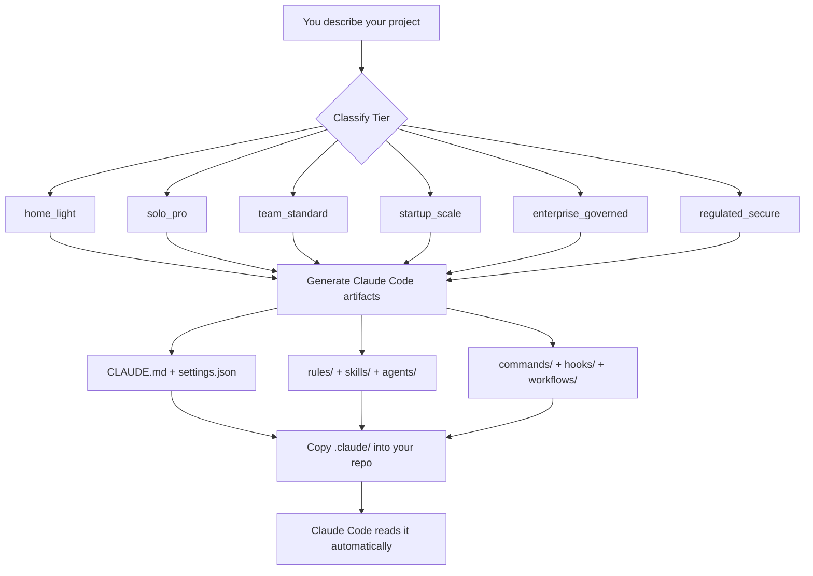

# 🧙 claude-wizardry

**A Claude Code framework factory — generate production-ready AI development environments for any project tier, from home coder to regulated enterprise.**

[](LICENSE)
[](https://docs.anthropic.com/en/docs/claude-code)
[](#-framework-tiers)
[](#-roadmap)
[](CONTRIBUTING.md)
[](https://github.com/JackSmack1971/claude-wizardry/issues?q=is%3Aissue+label%3A%22good+first+issue%22)

---

> **New to Claude Code?**  
> [Claude Code](https://docs.anthropic.com/en/docs/claude-code) is Anthropic's AI coding assistant that runs in your terminal. It reads special instruction files in your project — like `CLAUDE.md` and `.claude/settings.json` — and uses them to write code, run tests, and manage pull requests on your behalf. **This repo generates those instruction files for you.**

---

## ✨ What Does This Repo Do?

**claude-wizardry** is a _framework factory_. You tell it what kind of project you're working on, and it produces a complete, ready-to-drop-in Claude Code operating environment tailored to your situation.

```
You describe your project context
           ↓
claude-wizardry classifies your tier and architects the right framework
           ↓
Copy the generated .claude/ folder into your repo
           ↓
Claude Code reads it automatically — no extra setup
```

**Who is this for?**

| You are… | This gives you… |
|----------|----------------|
| 🏠 A home coder learning AI-assisted dev | A simple, safe starting point |
| 👤 A serious solo dev or consultant | Repeatable, disciplined AI workflows |
| 👥 A small team or OSS maintainer | Consistent AI behavior across contributors |
| 🚀 A growing startup with CI/CD | Guarded automation with hook enforcement |
| 🏢 An enterprise platform group | Governed settings, MCP allowlists, audit trails |
| 🔬 A regulated org or research lab | Traceable, approval-gated AI assistance |

---

## 🚀 Quickstart

> **You only need two things:**
> 1. [Git](https://git-scm.com/) — for cloning this repo
> 2. [Claude Code CLI](https://docs.anthropic.com/en/docs/claude-code) — the AI assistant that reads the framework files
>
> Install Claude Code with: `npm install -g @anthropic-ai/claude-code`  
> _(Node.js required — [get it here](https://nodejs.org))_

### Step 1 — Clone this repo

```bash
git clone https://github.com/JackSmack1971/claude-wizardry.git
cd claude-wizardry
```

### Step 2 — Browse the example scaffold

```bash
# See every file in the canonical 3-layer scaffold
cat WORKSPACE/EXAMPLE_STRUCTURE/FILE-TREE.txt

# Read plain-English explanations of each layer
cat WORKSPACE/EXAMPLE_STRUCTURE/README.md
```

### Step 3 — Copy a framework into your project

The `solo-pro-starter` is the most complete ready-to-use framework (TypeScript · Ethereum dapps · viem/ethers):

```bash
# Replace /path/to/your-project with your actual project folder
cp -r WORKSPACE/solo-pro-starter/.claude  /path/to/your-project/
cp    WORKSPACE/solo-pro-starter/CLAUDE.md /path/to/your-project/
cp    WORKSPACE/solo-pro-starter/AGENTS.md /path/to/your-project/
```

### Step 4 — Open Claude Code in your project

```bash
cd /path/to/your-project
claude
```

Claude Code will automatically discover and load every framework file. You're ready.

---

## 📁 Repository Layout

```
claude-wizardry/
├── AGENTS.md                        ← Mission doc + architect rules for this repo
├── LICENSE                          ← MIT License
├── SOUL/                            ← Public SSOT: tier doctrine, artifact contracts, design philosophy
│   └── CLAUDE.md                    ← The authoritative framework reference for contributors
└── WORKSPACE/                       ← Every generated framework lives here
    ├── EXAMPLE_STRUCTURE/           ← Canonical 3-layer reference scaffold
    │   ├── enterprise-system/       ← IT/platform admin-managed policies
    │   ├── user-home/.claude/       ← Global developer preferences
    │   └── project-root/            ← Per-repo Claude instructions + tools
    └── solo-pro-starter/            ← Featured framework (TypeScript Ethereum dapp)
        ├── .claude/
        │   ├── agents/              ← Specialized AI sub-agents
        │   ├── commands/            ← Custom slash commands
        │   ├── hooks/               ← Auto-run scripts (pre/post tool use, session)
        │   ├── rules/               ← Domain guardrails (security, architecture…)
        │   ├── skills/              ← Reusable AI skill modules
        │   └── workflows/           ← Multi-step automations (issue → PR, audits)
        ├── CLAUDE.md                ← Root instructions for Claude
        └── AGENTS.md                ← Sub-agent roster and roles
```

> **`SOUL/` is the single source of truth for this project.** If you want to understand how tiers are defined, what artifacts belong where, or what the security defaults are — start with [`SOUL/CLAUDE.md`](SOUL/CLAUDE.md).

---

## 🏗️ Framework Tiers

Each tier builds on the one before it. Pick the lowest tier that covers your needs — you can always upgrade later.

| Tier | Best For | Core Artifacts |
|------|----------|---------------|
| `home_light` | Home coder, learner | `CLAUDE.md` · `settings.json` · 2 commands |
| `solo_pro` | Solo dev, consultant | + rules · 3+ skills · 1–2 agents |
| `team_standard` | Small team, OSS, agency | + review/release commands · output styles |
| `startup_scale` | Growing team with CI/CD | + hooks · workflow scripts · security rules |
| `enterprise_governed` | Enterprise platform group | + managed settings · MCP allowlists · audit logs |
| `regulated_secure` | Research lab, regulated org | + traceability · approval gates · evidence templates |

> **Tip:** Claude Code will suggest a tier classification and ask one clarifying question before generating anything — you never have to guess.

---

## 🧩 Generated Artifacts Reference

A "framework" is a set of plain text files that Claude Code reads automatically. Here's what each file type does:

| File | Plain-English Purpose |
|------|-----------------------|
| `CLAUDE.md` | The main instruction file — tells Claude how to behave in your project |
| `.claude/settings.json` | What Claude is allowed/forbidden to do; security permissions |
| `.claude/rules/*.md` | Guardrails for specific domains (e.g. "never modify a prod ABI without review") |
| `.claude/agents/*.md` | Specialist AI sub-agents Claude can delegate tasks to |
| `.claude/commands/*.md` | Slash commands you can type (e.g. `/review-pr`) |
| `.claude/hooks/*.js` | Scripts that run automatically before/after every tool call |
| `.claude/skills/*/SKILL.md` | Reusable knowledge modules Claude loads on demand |
| `.claude/workflows/*.js` | Multi-step automations (e.g. issue → branch → PR in one command) |
| `.claude/output-styles/*.md` | Custom response formats for specific tasks |

---

## 🔍 Featured Framework: `solo-pro-starter`

Built for a TypeScript Ethereum dapp developer. Uses `viem` as the primary client library, with `ethers` v6 compatibility where a project already uses it.

### Included Agents

| Agent | What It Does |
|-------|-------------|
| `implementation-agent` | Writes code from GitHub issues, enforces stack rules |
| `pr-reviewer` | Reviews PRs for correctness, security, and ABI drift |
| `release-gatekeeper` | Runs pre-release checks before any tag or publish |
| `upstream-auditor` | Flags outdated or breaking upstream dependency changes |
| `web3-auditor` | Audits contract surfaces, wallet flows, and signature logic |

### Slash Commands

```
/review-pr          → Full PR review with security checklist
/create-pr          → Turn a GitHub issue into a branch + PR automatically
/audit/upstream     → Check for dep drift and breaking upstream changes
/audit/web3         → Audit on-chain surfaces and wallet flow regressions
/release/readiness  → Gate check before tagging a release
```

### Security Enforcement

These rules are **always enforced** via `settings.json` — Claude cannot override them:

- 🚫 Reading `.env` files or secrets directories
- 🚫 Destructive shell patterns (`rm -rf`, force push, database drops)

These require **explicit confirmation** every time:

- ⚠️ Dependency additions
- ⚠️ Database migrations
- ⚠️ Contract ABI changes, deployment scripts, signer logic
- ⚠️ Public API changes, CI/CD workflow edits

---

## 🏛️ Architecture

### How the Framework Factory Works



### The 3-Layer Configuration Model

Claude Code merges settings from three layers, in this priority order:

```
enterprise-system/managed-settings.json    ← IT/platform team: enforced org-wide policy
          ↓ can override
user-home/.claude/settings.json            ← You: personal global preferences
          ↓ can override
project-root/.claude/settings.json         ← Your repo: project-specific rules
```

**Why this matters for beginners:** You only need to touch the third layer. The first two are optional — for organizations that need stricter control.

---

## 🤝 Contributing

All skill levels welcome. Start with a [good first issue](https://github.com/JackSmack1971/claude-wizardry/issues?q=is%3Aissue+label%3A%22good+first+issue%22) if you're new.

### Step-by-Step Contribution Guide

```bash
# 1. Fork on GitHub, then clone your fork
git clone https://github.com/YOUR_USERNAME/claude-wizardry.git
cd claude-wizardry

# 2. Create a feature branch (use kebab-case)
git checkout -b feat/your-feature-name

# 3. Make your changes
#    New frameworks → WORKSPACE/<slug-name>/
#    Always include a README.md in your new framework folder
#    NEVER commit anything from SOUL/ or any secrets

# 4. Verify your scaffold (no automated tests — structural checks)
find WORKSPACE/your-new-framework -path "*/.claude/*" -print
# Every file referenced in CLAUDE.md must exist

# 5. Commit with a conventional prefix
git commit -m "scaffold: add team-standard react framework"

# 6. Push and open a PR on GitHub
git push origin feat/your-feature-name
```

### Commit Message Prefixes

| Prefix | Use For |
|--------|---------|
| `docs:` | README, AGENTS.md, or other documentation |
| `scaffold:` | New framework or major scaffold change |
| `fix:` | Correcting a path, hook, or rule reference |
| `feat:` | New tier, new artifact type, new tool |

### Before You Contribute

Read [`SOUL/CLAUDE.md`](SOUL/CLAUDE.md) first — it defines the tier doctrine, artifact contracts, naming conventions, and security defaults that all frameworks must follow. It's the authoritative reference for what belongs where and why.

### What a Good PR Includes

1. **What changed** — list every file path affected
2. **Why** — what problem it solves or which tier it improves
3. **Verification** — confirm `.claude/` paths exist and referenced files are present
4. **Screenshots** — if any rendered Markdown changed

---

## 📋 Code of Conduct

This project follows the [Contributor Covenant v2.1](https://www.contributor-covenant.org/version/2/1/code_of_conduct/). Be kind, be constructive, and be patient — especially with newcomers.

---

## 🗺️ Roadmap

| Status | Item |
|--------|------|
| ✅ Done | `solo_pro` tier framework (`solo-pro-starter`) |
| ✅ Done | Complete `EXAMPLE_STRUCTURE` 3-layer scaffold |
| 🔲 Planned | `home_light` starter template |
| 🔲 Planned | `team_standard` framework (review/release focus) |
| 🔲 Planned | `startup_scale` framework (CI/CD hooks) |
| 🔲 Planned | `enterprise_governed` managed-settings templates |
| 🔲 Planned | `regulated_secure` framework (traceability, evidence gates) |
| 🔲 Planned | Interactive CLI scaffolder (`npx claude-wizardry init`) |
| 🔲 Planned | Automated structural validation script |

---

## 🔒 Security

**Do not open a public GitHub issue for security vulnerabilities.**

Report security issues privately via [GitHub's vulnerability reporting](https://github.com/JackSmack1971/claude-wizardry/security/advisories/new).

All generated frameworks enforce the following by default — these cannot be disabled without editing `settings.json` directly:

- Secrets and `.env` files are always read-blocked
- Destructive shell operations are always denied
- High-risk operations (deployments, migrations, API changes) always require confirmation

---

## 📄 License

[MIT](LICENSE) © 2026 JackSmack1971

---

<p align="center">
  <em>home = simple · solo = repeatable · team = consistent · startup = guarded · enterprise = governed · regulated = traceable</em>
</p>
