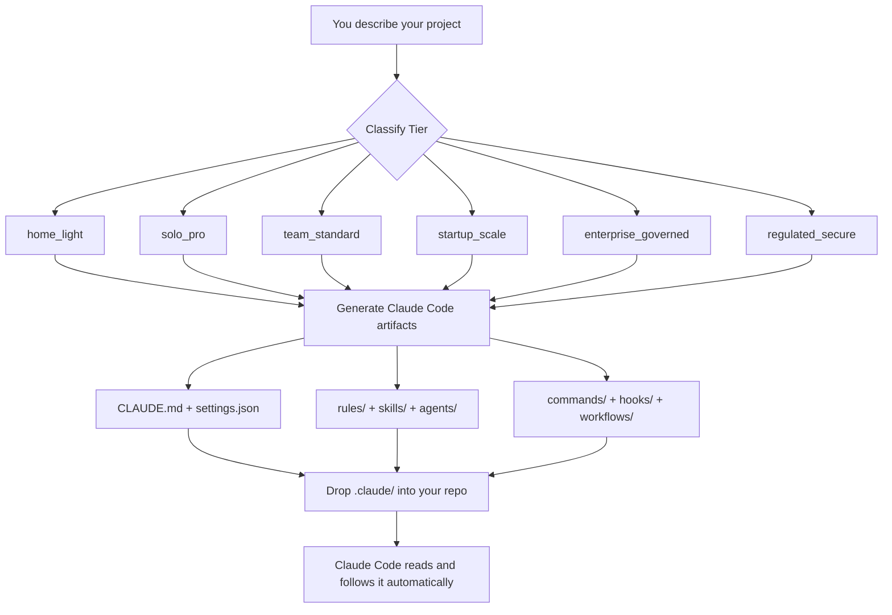

# 🧙 claude-wizardry

**A Claude Code framework factory — generate production-ready AI operating environments for any project tier, from home coder to regulated enterprise.**

[](LICENSE)
[](https://docs.anthropic.com/en/docs/claude-code)
[](#️-framework-tiers)
[](#️-roadmap)
[](CONTRIBUTING.md)
[](https://github.com/JackSmack1971/claude-wizardry/issues?q=is%3Aissue+label%3A%22good+first+issue%22)

---

> **New to Claude Code?**
>
> [Claude Code](https://docs.anthropic.com/en/docs/claude-code) is Anthropic's AI coding assistant that runs in your terminal. It reads special instruction files in your project — like `CLAUDE.md` and `.claude/settings.json` — and uses them to write code, run tests, and manage pull requests on your behalf. **This repo generates those instruction files for you.**

---

## 🛠️ Two CLIs, One Pipeline

> **This repo runs inside [OpenAI Codex CLI](https://github.com/openai/codex) — not inside Claude Code.** These are two separate tools from two different companies. Understanding which does what is the most important thing to read before you start.

| Tool | Made By | Role in This Repo |
|------|---------|-------------------|
| **[Codex CLI](https://github.com/openai/codex)** | OpenAI | **Runs claude-wizardry** — reads `AGENTS.md`, classifies your tier, and generates the framework files |
| **[Claude Code CLI](https://docs.anthropic.com/en/docs/claude-code)** | Anthropic | **Consumes the output** — reads the generated `.claude/` folder in your project and acts as your AI coding assistant |

```
You (inside Codex CLI)  →  claude-wizardry generates  →  .claude/ framework files
                                                                    ↓
                                             Claude Code CLI reads them in your project
```

**Why Codex CLI to build Claude Code frameworks?** Codex CLI's `AGENTS.md`-driven agentic model is well-suited for the multi-step classification and generation work required here. The output is vendor-neutral plain text — `.md` and `.json` files that any Claude Code installation picks up automatically.

### What You Need

| Step | Tool | Install |
|------|------|---------|
| Generate frameworks (this repo) | **Codex CLI** | `npm install -g @openai/codex` |
| Use the generated frameworks | **Claude Code CLI** | `npm install -g @anthropic-ai/claude-code` |

---

## ✨ What Does This Repo Do?

**claude-wizardry** is a _framework factory_. You describe your project context and it produces a complete, ready-to-drop-in Claude Code operating environment — no templates to fill in, no guessing what files go where.

```
You describe your project context
           ↓
claude-wizardry classifies your tier and architects the right framework
           ↓
Copy the generated .claude/ folder into your repo
           ↓
Claude Code reads it automatically — no extra setup
```

**Who is this for?**

| You are… | This gives you… |
|----------|----------------|
| 🏠 A home coder learning AI-assisted dev | A simple, safe starting point |
| 👤 A serious solo dev or consultant | Repeatable, disciplined AI workflows |
| 👥 A small team or OSS maintainer | Consistent AI behavior across contributors |
| 🚀 A growing startup with CI/CD | Guarded automation with hook enforcement |
| 🏢 An enterprise platform group | Governed settings, MCP allowlists, audit trails |
| 🔬 A regulated org or research lab | Traceable, approval-gated AI assistance |

---

## 🚀 Quickstart

> **You only need two things:**
> 1. [Git](https://git-scm.com/) — for cloning this repo
> 2. [Claude Code CLI](https://docs.anthropic.com/en/docs/claude-code) — the AI assistant that reads the framework files
>
> Install Claude Code: `npm install -g @anthropic-ai/claude-code`
> _(Requires [Node.js](https://nodejs.org) — free to download)_

### Step 1 — Clone this repo

```bash
git clone https://github.com/JackSmack1971/claude-wizardry.git
cd claude-wizardry
```

### Step 2 — Read the doctrine (optional but recommended)

```bash
# Understand the tier model and artifact contracts before customizing
cat SOUL/CLAUDE.md
```

### Step 3 — Browse the example scaffold

```bash
# See every file in the canonical 3-layer scaffold
cat WORKSPACE/EXAMPLE_STRUCTURE/FILE-TREE.txt

# Read plain-English explanations of each layer
cat WORKSPACE/EXAMPLE_STRUCTURE/README.md
```

### Step 4 — Copy a framework into your project

The `solo-pro-starter` is the most complete ready-to-use framework (TypeScript · Ethereum dapps · viem/ethers):

```bash
# Replace /path/to/your-project with your actual project folder
cp -r WORKSPACE/solo-pro-starter/.claude  /path/to/your-project/
cp    WORKSPACE/solo-pro-starter/CLAUDE.md /path/to/your-project/
cp    WORKSPACE/solo-pro-starter/AGENTS.md /path/to/your-project/
```

### Step 5 — Open Claude Code in your project

```bash
cd /path/to/your-project
claude
```

Claude Code will automatically discover and load every framework file. You're ready.

---

## 📁 Repository Layout

```
claude-wizardry/
├── AGENTS.md                        ← Mission doc + architect rules for this repo
├── LICENSE                          ← MIT License
├── SOUL/                            ← Public SSOT: tier doctrine, artifact contracts, design philosophy
│   └── CLAUDE.md                    ← The authoritative framework reference — read this first
└── WORKSPACE/                       ← Every generated framework lives here
    ├── EXAMPLE_STRUCTURE/           ← Canonical 3-layer reference scaffold
    │   ├── enterprise-system/       ← IT/platform admin-managed policies
    │   ├── user-home/.claude/       ← Global developer preferences
    │   └── project-root/            ← Per-repo Claude instructions + tools
    └── solo-pro-starter/            ← Featured framework (TypeScript Ethereum dapp)
        ├── .claude/
        │   ├── agents/              ← Specialized AI sub-agents
        │   ├── commands/            ← Custom slash commands (e.g. /review-pr)
        │   ├── hooks/               ← Auto-run scripts (before/after every tool call)
        │   ├── rules/               ← Domain guardrails (security, architecture…)
        │   ├── skills/              ← Reusable AI skill modules
        │   └── workflows/           ← Multi-step automations (issue → PR, audits)
        ├── CLAUDE.md                ← Root instructions for Claude
        └── AGENTS.md                ← Sub-agent roster and roles
```

> **`SOUL/` is the single source of truth.** Tier doctrine, artifact contracts, security defaults, naming conventions — all of it lives in [`SOUL/CLAUDE.md`](SOUL/CLAUDE.md). Read it before building or contributing a framework.

---

## 🏗️ Framework Tiers

Each tier builds on the one before it. Pick the lowest tier that covers your needs — you can always upgrade later.

| Tier | Best For | Core Artifacts |
|------|----------|---------------|
| `home_light` | Home coder, learner | `CLAUDE.md` · `settings.json` · 2 commands |
| `solo_pro` | Solo dev, consultant | + rules · 3+ skills · 1–2 agents |
| `team_standard` | Small team, OSS, agency | + review/release commands · output styles |
| `startup_scale` | Growing team with CI/CD | + hooks · workflow scripts · security rules |
| `enterprise_governed` | Enterprise platform group | + managed settings · MCP allowlists · audit logs |
| `regulated_secure` | Research lab, regulated org | + traceability · approval gates · evidence templates |

> **Tip:** When you ask Claude Code to build a framework, it will suggest a tier and ask one clarifying question before generating anything — you never have to guess.

---

## 🧩 Generated Artifacts Reference

A "framework" is a set of plain-text files that Claude Code reads automatically. Here's what each type does:

| File | Plain-English Purpose |
|------|-----------------------|
| `CLAUDE.md` | Main instruction file — tells Claude how to behave in your project |
| `.claude/settings.json` | What Claude is allowed/forbidden to do; security permissions |
| `.claude/rules/*.md` | Guardrails for specific domains (e.g. "never modify a prod contract ABI without review") |
| `.claude/agents/*.md` | Specialist AI sub-agents Claude can delegate tasks to |
| `.claude/commands/*.md` | Slash commands you can type (e.g. `/review-pr`, `/audit/web3`) |
| `.claude/hooks/*.js` | Scripts that run automatically before/after every tool call |
| `.claude/skills/*/SKILL.md` | Reusable knowledge modules Claude loads on demand |
| `.claude/workflows/*.js` | Multi-step automations (e.g. issue → branch → PR in one command) |
| `.claude/output-styles/*.md` | Custom response formats for specific tasks |

---

## 🔍 Featured Framework: `solo-pro-starter`

Built for a TypeScript Ethereum dapp developer. Uses `viem` as the primary client library (`createPublicClient`, `createWalletClient`, typed contract interactions), with `ethers` v6 compatibility where a repo already uses it.

### Included Agents

| Agent | What It Does |
|-------|-------------|
| `implementation-agent` | Writes code from GitHub issues, enforces stack and chain rules |
| `pr-reviewer` | Reviews PRs for correctness, security, and ABI drift |
| `release-gatekeeper` | Runs pre-release checks before any tag or publish |
| `upstream-auditor` | Flags outdated or breaking upstream dependency changes |
| `web3-auditor` | Audits contract surfaces, wallet flows, and signature logic |

### Available Slash Commands

```
/review-pr          → Full PR review with security checklist
/create-pr          → Issue → branch → PR automation
/audit/upstream     → Check for outdated deps and breaking upstream changes
/audit/web3         → Audit contract surfaces and wallet flow regressions
/release/readiness  → Pre-release gate check
```

### Security Rules Enforced

| What | Rule |
|------|------|
| `.env` files and secrets directories | Always blocked (read + write) |
| `rm -rf`, force push, DB drops | Always blocked |
| Contract ABI changes, deployment scripts, signer logic | Require explicit confirmation |
| Dependency additions, DB migrations, public API changes | Require explicit confirmation |

---

## 🏛️ Architecture

### How the Framework Factory Works



### The 3-Layer Config Model

```
enterprise-system/managed-settings.json   ← IT/platform: enforced policies (overrides all)
        ↓ overridden by
user-home/.claude/settings.json           ← Developer: personal global preferences
        ↓ overridden by
project-root/.claude/settings.json        ← Repo: project-specific rules
```

This mirrors how real organizations work — admins set policy, developers customize within bounds, projects add specifics.

---

## 🤝 Contributing

### Before You Start

Read [`SOUL/CLAUDE.md`](SOUL/CLAUDE.md) first. It defines the tier doctrine, artifact contracts, security defaults, and naming conventions that every framework must follow. It's the authoritative reference for what belongs where and why.

### Good First Issues

Browse issues tagged [`good first issue`](https://github.com/JackSmack1971/claude-wizardry/issues?q=is%3Aissue+label%3A%22good+first+issue%22) — these are intentionally small, well-scoped, and don't require deep framework knowledge.

### Development Workflow

```bash
# 1. Fork and clone
git clone https://github.com/YOUR_USERNAME/claude-wizardry.git
cd claude-wizardry

# 2. Create a branch
git checkout -b feat/your-feature-name

# 3. Make your changes
# - New frameworks go in WORKSPACE/<slug-name>/
# - Always include a README.md in your framework folder
# - Never commit secrets or machine-local paths

# 4. Verify your scaffold — no test runner, structural checks only
find WORKSPACE/your-new-framework -path "*/.claude/*" -print
# Every file referenced in CLAUDE.md must exist on disk

# 5. Commit with a conventional prefix
git commit -m "scaffold: add team-standard react framework"

# 6. Push and open a PR
git push origin feat/your-feature-name
```

### Commit Message Prefixes

| Prefix | Use For |
|--------|---------|
| `docs:` | README, AGENTS.md, or SOUL/ documentation |
| `scaffold:` | New framework or major scaffold change |
| `fix:` | Correcting a path, hook, or rule reference |
| `feat:` | New tier, new artifact type, new tool |

### What a Good PR Includes

1. **What changed** — list every file path affected
2. **Why** — what problem it solves or which tier it improves
3. **Verification** — confirm `.claude/` paths exist and referenced files are present
4. **Screenshots** — if any rendered Markdown changed

---

## 📋 Code of Conduct

This project follows the [Contributor Covenant v2.1](https://www.contributor-covenant.org/version/2/1/code_of_conduct/). Be kind, be constructive, and be patient — especially with newcomers.

---

## 🗺️ Roadmap

| Status | Item |
|--------|------|
| ✅ Done | `solo_pro` tier framework (`solo-pro-starter`) |
| ✅ Done | Complete `EXAMPLE_STRUCTURE` 3-layer scaffold |
| ✅ Done | `SOUL/` made public as open SSOT |
| ⬜ Planned | `home_light` starter template |
| ⬜ Planned | `team_standard` framework (review/release focus) |
| ⬜ Planned | `startup_scale` framework (CI/CD hooks) |
| ⬜ Planned | `enterprise_governed` managed-settings templates |
| ⬜ Planned | `regulated_secure` framework (traceability, evidence gates) |
| ⬜ Planned | Interactive CLI scaffolder (`npx claude-wizardry init`) |
| ⬜ Planned | Automated structural validation script |

---

## 🔒 Security

**Do not open public issues for security vulnerabilities.**

Report security issues via [GitHub's private vulnerability reporting](https://github.com/JackSmack1971/claude-wizardry/security/advisories/new).

**Security defaults enforced in every generated framework:**

- Secrets, `.env`, and key files — always read/write blocked
- Destructive shell patterns (`rm -rf`, force push, `DROP TABLE`) — always denied
- High-risk operations (deployments, migrations, ABI changes, dep additions) — require explicit confirmation

Full security doctrine is in [`SOUL/CLAUDE.md`](SOUL/CLAUDE.md).

---

## 📄 License

[MIT](LICENSE) © 2026 JackSmack1971

---

<p align="center">
  <em>home = simple · solo = repeatable · team = consistent · startup = guarded · enterprise = governed · regulated = traceable</em>
</p>
