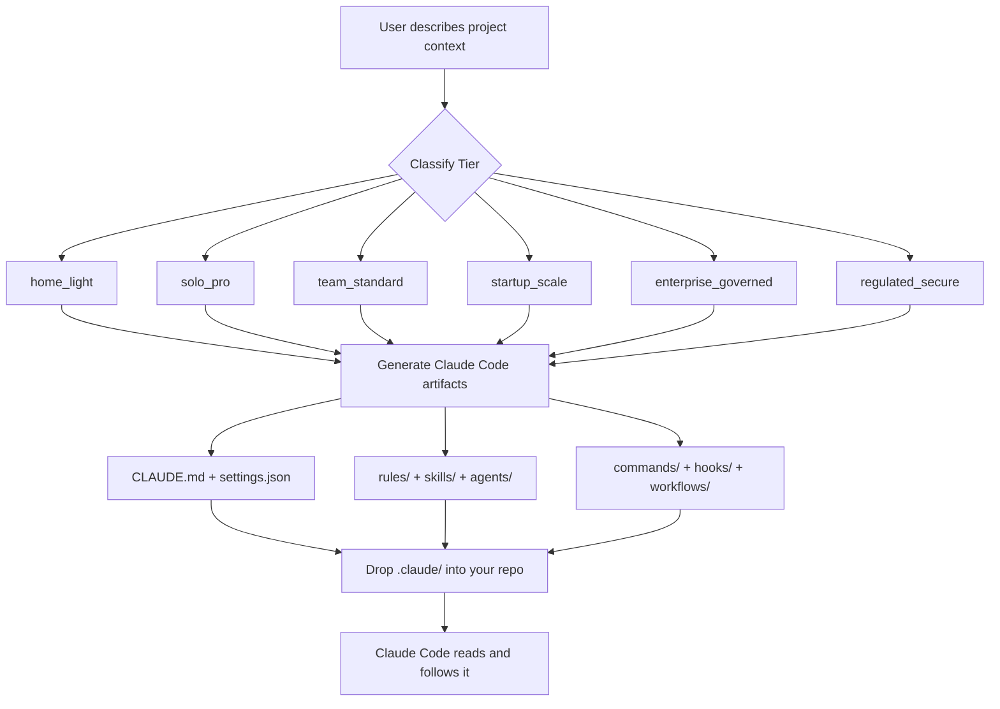

# 🧙 claude-wizardry

**A Claude Code framework factory — generate production-ready AI development environments for any project tier, from home coder to regulated enterprise.**

[](LICENSE)
[](https://docs.anthropic.com/en/docs/claude-code)
[](#-framework-tiers)
[](#-roadmap)
[](CONTRIBUTING.md)

---

> **What is Claude Code?**  
> [Claude Code](https://docs.anthropic.com/en/docs/claude-code) is Anthropic's AI coding assistant that lives in your terminal and IDE. It reads your project, follows instructions in special files like `CLAUDE.md`, and can write code, run tests, and manage pull requests for you. This repo builds the "instruction layer" that makes Claude Code work brilliantly for your specific situation.

---

## ✨ What Does This Repo Do?

**claude-wizardry** is a _framework factory_. You describe your project context and tier, and it generates a complete, ready-to-use Claude Code operating environment — no templates to fill in manually, no guessing what files go where.

```
You describe your project
        ↓
claude-wizardry architects the right framework
        ↓
Drop the generated .claude/ folder into your repo
        ↓
Claude Code follows it automatically
```

**Who is this for?**
- 🏠 Home coders learning to leverage AI in their workflow
- 👤 Serious solo developers who want repeatable, disciplined AI assistance
- 👥 Small teams and OSS maintainers who need consistent AI behavior
- 🏢 Enterprises that need governed, auditable AI tooling

---

## 🚀 Quickstart

> **Prerequisites:**
> - [Git](https://git-scm.com/) installed
> - [Claude Code CLI](https://docs.anthropic.com/en/docs/claude-code) installed (`npm install -g @anthropic-ai/claude-code`)
> - No special languages required to _use_ this repo — just copy files!

### 1. Clone the repo

```bash
git clone https://github.com/JackSmack1971/claude-wizardry.git
cd claude-wizardry
```

### 2. Browse the example scaffold

```bash
# See the complete 3-layer scaffold layout
cat WORKSPACE/EXAMPLE_STRUCTURE/FILE-TREE.txt

# Read what each layer does
cat WORKSPACE/EXAMPLE_STRUCTURE/README.md
```

### 3. Copy a starter framework into your project

The `solo-pro-starter` is the most complete ready-to-use framework:

```bash
# Copy the .claude/ folder into YOUR project
cp -r WORKSPACE/solo-pro-starter/.claude /path/to/your-project/

# Also copy the root instruction files
cp WORKSPACE/solo-pro-starter/CLAUDE.md /path/to/your-project/
cp WORKSPACE/solo-pro-starter/AGENTS.md /path/to/your-project/
```

### 4. Open Claude Code in your project

```bash
cd /path/to/your-project
claude
```

Claude Code will automatically discover and load all the framework files. You're ready to go!

---

## 📁 Repository Layout

```
claude-wizardry/
├── AGENTS.md                    ← Mission doc and architect guide for this repo
├── LICENSE                      ← MIT License
└── WORKSPACE/                   ← All generated frameworks live here
    ├── EXAMPLE_STRUCTURE/       ← Canonical 3-layer Claude Code scaffold reference
    │   ├── enterprise-system/   ← Admin-managed policies (IT/platform teams)
    │   ├── user-home/.claude/   ← Global user preferences (applies to all projects)
    │   └── project-root/        ← Per-repo Claude instructions and tools
    └── solo-pro-starter/        ← Featured framework: TypeScript Ethereum dapp dev
        ├── .claude/             ← The complete Claude Code environment
        │   ├── agents/          ← Specialized AI sub-agents
        │   ├── commands/        ← Slash commands (e.g. /review-pr, /create-pr)
        │   ├── hooks/           ← Auto-run scripts on tool use, session start, stop
        │   ├── rules/           ← Domain-specific guardrails (architecture, security…)
        │   ├── skills/          ← Reusable AI skill modules
        │   └── workflows/       ← Multi-step automation scripts (issue → PR, audits)
        ├── CLAUDE.md            ← Root instructions for Claude
        └── AGENTS.md            ← Sub-agent definitions
```

---

## 🏗️ Framework Tiers

Pick the tier that matches your context. Each tier builds on the previous one.

| Tier | Who It's For | What's Included |
|------|-------------|-----------------|
| `home_light` | Home coder, learner | `CLAUDE.md`, `settings.json`, 2 custom commands |
| `solo_pro` | Serious solo dev, consultant | + rules, 3+ skills, 1–2 agents |
| `team_standard` | Small team, OSS project, agency | + review/release commands, output styles |
| `startup_scale` | Growing team with CI/CD | + hooks, workflow scripts, security rules |
| `enterprise_governed` | Enterprise platform group | + managed settings, MCP allowlists, audit logs |
| `regulated_secure` | Research lab, regulated org | + traceability, approval gates, evidence templates |

> **Not sure which tier fits?** Claude Code will propose a classification and ask one clarifying question before generating anything.

---

## 🧩 What Gets Generated

A framework is a collection of **Claude Code-native artifacts** — files that Claude Code reads and acts on automatically.

| Artifact | What It Does |
|----------|-------------|
| `CLAUDE.md` | Main instruction file — tells Claude how to behave in your project |
| `.claude/settings.json` | Permissions, security rules, tool allowlists/denylists |
| `.claude/rules/*.md` | Domain guardrails (e.g. never modify production ABIs without review) |
| `.claude/agents/*.md` | Specialized sub-agents (e.g. PR reviewer, security auditor) |
| `.claude/commands/*.md` | Custom slash commands you can invoke (e.g. `/review-pr`) |
| `.claude/hooks/*.js` | Scripts that run automatically before/after tool use |
| `.claude/skills/*/SKILL.md` | Reusable skill modules Claude can invoke |
| `.claude/workflows/*.js` | Multi-step automations (issue → branch → PR) |
| `.claude/output-styles/*.md` | Custom response formats for specific tasks |

---

## 🔍 Highlighted Framework: `solo-pro-starter`

The `solo-pro-starter` framework is built for a TypeScript Ethereum dapp developer using `viem` (with `ethers` v6 support). It includes:

### Agents
| Agent | Role |
|-------|------|
| `implementation-agent` | Writes code from issues, respects stack rules |
| `pr-reviewer` | Reviews PRs for correctness, security, ABI drift |
| `release-gatekeeper` | Validates release readiness before tag/publish |
| `upstream-auditor` | Checks for upstream dependency drift |
| `web3-auditor` | Audits on-chain surfaces, wallet flows, signatures |

### Slash Commands
```
/review-pr         → Full PR review with security checklist
/create-pr         → Issue → branch → PR automation
/audit/upstream    → Check for outdated deps and breaking upstream changes
/audit/web3        → Audit contract surfaces and wallet flow regressions
/release/readiness → Pre-release gate check
```

### Security Rules
- `.env` files and secrets directories: **always blocked**
- Destructive shell patterns (`rm -rf`, force push, DB drops): **always blocked**
- Contract ABI changes, deployment scripts, signer logic: **require confirmation**
- Dependency additions, DB migrations, public API changes: **require confirmation**

---

## 🏛️ Architecture



### The 3-Layer Config Model

```
enterprise-system/managed-settings.json   ← IT/platform: enforced policies
    ↓ overrides
user-home/.claude/settings.json           ← Developer: personal global prefs
    ↓ overrides
project-root/.claude/settings.json        ← Repo: project-specific rules
```

This mirrors how real organizations work — admins set policy, developers customize within bounds, projects add specifics.

---

## 🤝 Contributing

Contributions are welcome! Here's how to get started:

### Good First Issues

Look for issues tagged [`good first issue`](https://github.com/JackSmack1971/claude-wizardry/issues?q=is%3Aissue+label%3A%22good+first+issue%22) — these are intentionally small and well-scoped.

### Development Workflow

```bash
# 1. Fork and clone
git clone https://github.com/YOUR_USERNAME/claude-wizardry.git
cd claude-wizardry

# 2. Create a branch
git checkout -b feat/your-feature-name

# 3. Make your changes
# - New frameworks go in WORKSPACE/<slug-name>/
# - Always include a README.md in your new framework folder
# - Never commit SOUL/ content or secrets

# 4. Verify your scaffold (no test runner — structural checks only)
find WORKSPACE/your-new-framework -path "*/.claude/*" -print
# Confirm all referenced files exist

# 5. Commit with conventional commits
git commit -m "scaffold: add team-standard react framework"

# 6. Push and open a PR
git push origin feat/your-feature-name
```

### Commit Style

```
docs: tighten AGENTS guide
scaffold: add enterprise hook example
fix: correct hook path reference
feat: add regulated-secure tier template
```

### What Makes a Good PR

Every PR should describe:
1. **What changed** — list affected file paths
2. **Why** — what problem it solves or what tier it serves
3. **Verification** — confirm `.claude/` paths exist and referenced files are present
4. **Screenshots** — if rendered docs changed

---

## 📋 Code of Conduct

This project follows the [Contributor Covenant Code of Conduct](https://www.contributor-covenant.org/version/2/1/code_of_conduct/). Be kind, be constructive, be patient with newcomers.

---

## 🗺️ Roadmap

- [x] `solo_pro` tier framework (`solo-pro-starter`)
- [x] Complete `EXAMPLE_STRUCTURE` 3-layer scaffold
- [ ] `home_light` starter template
- [ ] `team_standard` framework (review/release focus)
- [ ] `startup_scale` framework (CI/CD hooks)
- [ ] `enterprise_governed` managed-settings templates
- [ ] `regulated_secure` framework (traceability, evidence gates)
- [ ] Interactive CLI scaffolder (`npx claude-wizardry init`)
- [ ] Framework validation script (structural checks automated)

---

## 🔒 Security

**Please do not open public issues for security vulnerabilities.**

If you discover a security issue, email the maintainer directly or use [GitHub's private vulnerability reporting](https://github.com/JackSmack1971/claude-wizardry/security/advisories/new).

**Security defaults enforced in all generated frameworks:**

- Secrets and `.env` files are always read-blocked
- Destructive shell patterns are always denied
- High-risk operations (deployments, migrations, API changes) require explicit confirmation

---

## 📄 License

[MIT](LICENSE) © 2026 JackSmack1971

---

<p align="center">
  <em>home = simple · solo = repeatable · team = consistent · startup = guarded · enterprise = governed · regulated = traceable</em>
</p>
